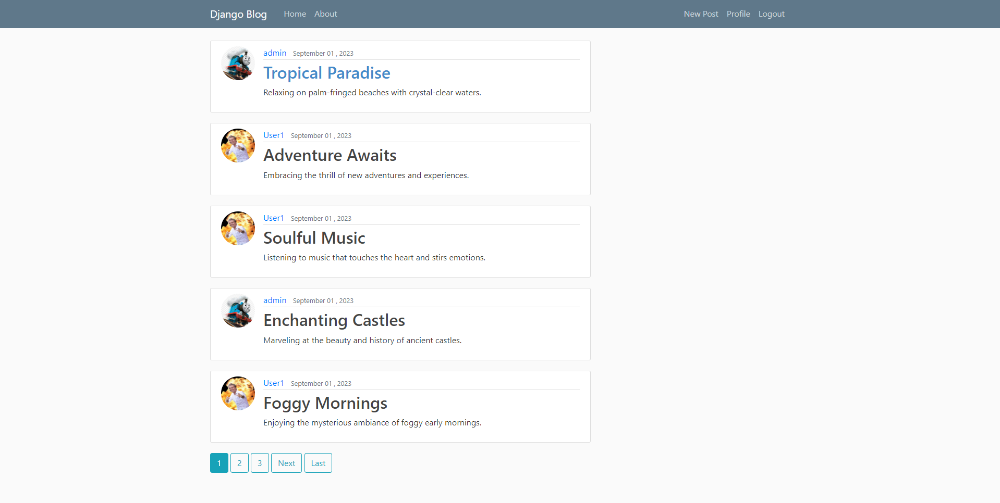

# Blog web app using django
## Overview
This is a simple blog application written with Python and Django. The application allows new users to sign up to the application and start creating posts. Fun little project to lear more about django and its pros and cons. 

## Features
* Registration and authentication from Django
* Post, edit and delete blog posts
* Change password via email link

  ## Setup
  1. Clone the repo
  2. Run `python manage.py migrate` to create the database
  3. Create a new admin user from django/django_project with
     `python manage.py createsuperuser`
  4. Add `db.sqlite3` to .gitignore
  5. Run the app with `python manage.py runserver`
  6. Populate the database with given json
      1. Log in to localhost:8000/admin with the admin credentials you created
      2. Create at leat two new users from the admin page
      3. From `/django`, run `python .\addPostsFromJson.py` from the terminal
      4. Refresh the tab
  7. Setup password recovery with gmail
      1. Navigate to your Google profile
      2. NAvigate to security
      3. Navigate to 2-step verification
      4. Navigate to App Passwords and generate a new App Password
      5. Save the given password and email in environment variables as `mail_server_PW` and `mail_server_user`

    # Resources
 * https://youtube.com/playlist?list=PL-osiE80TeTtoQCKZ03TU5fNfx2UY6U4p&feature=shared
 * https://docs.djangoproject.com/en/4.2/
